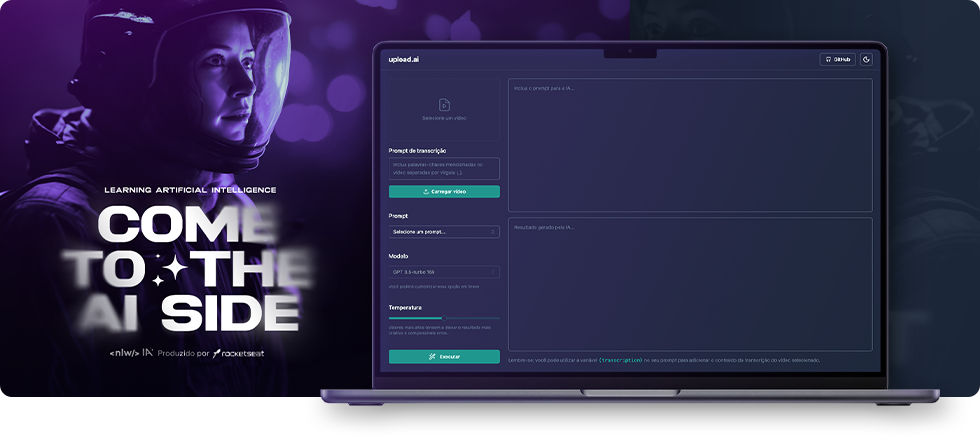

# Upload.ai :: React Front-End Application



Aplicação Front-End desenvolvida durante a 13ª edição do NLW (Next Level Week), focada no desenvolvimento e integração com IA (Inteligência Artificial), realizada pela Rocketseat. Neste evento, realizei o desenvolvimento Full Stack de toda a aplicação, através de tecnologias como `React`, `Node.js`, `TailwindCSS`, `WebAssembly`, `Prisma`, entre outras.

Este repositório contém todo o desenvolvimento Front-End da aplicação, [confira a parte Back-End aqui](https://github.com/julianosill/nlwia-upload-api).

## Tecnologias utilizadas no Front-End

`Javascript` `React` `WebAssembly` `OpenAI`

- **Biblitecas, pacotes e utilitários adicionais**
- `TypeScript` `TailwindCSS` `Radix UI` `shadcn/ui` `Axios` `FFmpeg` `Lucide Icons`

## Como executar a aplicação

_Você deve ter o gerenciador `pnpm` instalado. Caso não tenha, [clique aqui e faça a instalação](https://pnpm.io/installation). Se já tiver o `npm` instalado, basta executar `npm install -g pnpm` em seu terminal._

- Clone este projeto, executando o seguinte comando:

> ```properties
> git clone https://github.com/julianosill/nlwia-upload.ai.git
> ```

- Instale as dependências necessárias:

> ```properties
> pnpm i
> ```

- Após concluir a instalação, inicie seu servidor local com:

> ```properties
> pnpm run dev
> ```

- Acesse a aplicação em [`http://localhost:5173`](http://localhost:5173) ou altere a porta, caso o terminal especifique outra porta.
